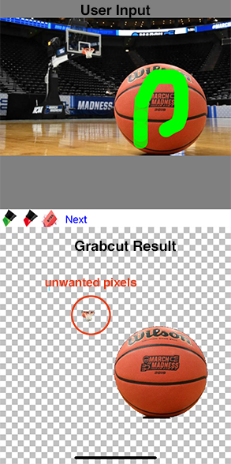
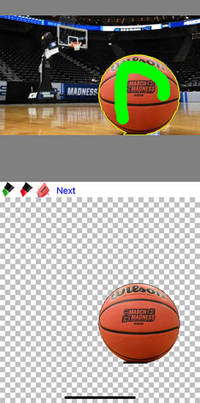

# Chop Shop (Open Source)
## What is this?
Chop Shop was originally an iOS app I developed with idea of letting users quickly "photoshop" images on mobile. It was a WYISWYG image editor with layers, text, and implemented a foreground segmentation system with ```OpenCV Grabcut``` algorithm. It was originally written in Objective-C, so I only ported over the core components to Swift.

## How it works:
```Grabcut``` is a function that takes an image and mask. The mask is a matrix of pixels identifying parts that the user flags as 'keep' or 'remove'. Grabcut then returns a matrix identifying objects that the user probably wants to segment.

The first step was designing a red/green markup interface to let the user design a mask. Green means keep these pixels, red means throw them away. With just a bit of info, the grabcut algorithm does a decent job:



However, its not perfect. Grabcut sometimes returns pixels outside the body of our target object (probably based on color). To clean it up, we can use the nifty ```findContours()``` function on the result image, which gives us whole bodies of pixels. If we find a separate body of pixels that have not been specifically marked as 'keep' (green) by the user, we can throw them away. We can also draw a contour with a yellow highlight border to give a better UX. The result:



## Optimizations:
The whole process can sometimes take a long time, 5 to 20 seconds of computing depending on the device. Obviously we need to throw this on a background thread with ```DispatchQueue.global().async{}``` while showing a loader.

We can also affect quality by changing the ```iterations``` value in the Grabcut function parameter. More iterations = better results, but more processing time.

But there is one trick to saving processing time without sacrificing too much performance. A common technique in image/video manipulation: downsampling! By simply making our source image smaller, we can get away with less computation time, but comparable results. I added a ```(BOOL)downsample``` parameter, which if flagged will simply halve the width/height of the source image. Once we have the Grabcut result, we can simply scale resulting mask up to match the original dimensions.

### <a href="ChopShopOpenSource/OpenCVWrapper/OpenCVWrapper.mm">Click here to see all the fun image processing code</a>

## Demo video


## Installation

This project uses  ```Cocoapods```, a dependency package manager. If you don't have it, run in terminal:

```bash
$ sudo gem install cocoapods
```

Install dependencies by navigating to the root project folder where Podfile is located, running:
```bash
$ pod install
```

## Open Workspace
Open and use the ```ChopShopOpenSource.xcworkspace```. Written for iOS 14.0.
